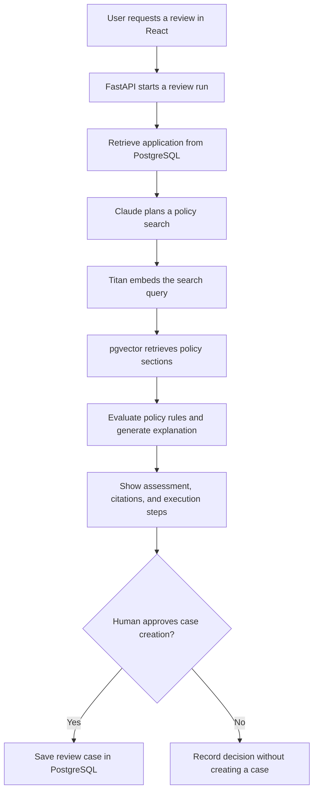

# Banking Loan Review Agent: How the Flow Works

The agent combines application data from PostgreSQL with policy documents, prepares a cited assessment, and waits for approval before creating a review case.

## The flow at a glance

## 1. Before a review: prepare the policies

The ingestion process reads our three synthetic policy documents:

- Personal-loan policy
- Credit-risk policy
- Income-verification policy

It splits them into **six policy sections**. Titan converts each section into an *embedding*: a list of numbers representing its meaning.

PostgreSQL stores those embeddings through **pgvector**, alongside the original text, source filename, page number, and citation ID.

## 2. You request a review

In the React UI, you enter:

> Review application L002 against our lending policies.

FastAPI extracts `L002`, creates a review run, and starts the **LangGraph workflow**. LangGraph coordinates the steps and saves progress in PostgreSQL.

## 3. The agent retrieves application data

The constrained `get_loan_application` tool runs a parameterized database query.

For L002, it retrieves:

| Fact | Value |
|---|---:|
| Loan amount | $45,000 |
| Term | 60 months |
| Credit score | 630 |
| Debt-to-income ratio | 42% |
| Income verified | No |
| Employment tenure | 8 months |

Claude never generates or executes arbitrary SQL.

## 4. The agent retrieves policy evidence

Claude creates a search query covering the application's relevant facts.

Titan embeds that query, and `search_bank_policies` uses pgvector to rank the policy sections by similarity.

**For this small demo, all six required sections are retrieved**, ensuring that no mandatory check is missed.

## 5. The assessment is prepared

Explicit rules in the synthetic policies identify four issues:

- Credit score below **660**
- Debt-to-income ratio above **40%**
- Unverified income
- Employment tenure below **12 months**

These rules determine **Enhanced Manual Review**. Claude writes the explanation using the application and assessment.

**The policy rules control the recommendation; Claude supplies search planning and explanatory prose.** Each check carries a citation you can expand in the UI.

## 6. The workflow pauses for your approval

LangGraph saves its state and pauses. **No review case exists yet.**

When you approve:

1. FastAPI records your decision.
2. LangGraph resumes.
3. `create_review_case` checks that approval was recorded.
4. PostgreSQL saves the case and its cited assessment.

Repeated approval returns the same case instead of creating a duplicate.

If you decline, the system records your decision without creating a review case.

**Approving here authorizes case creation only. It does not approve the loan.**
